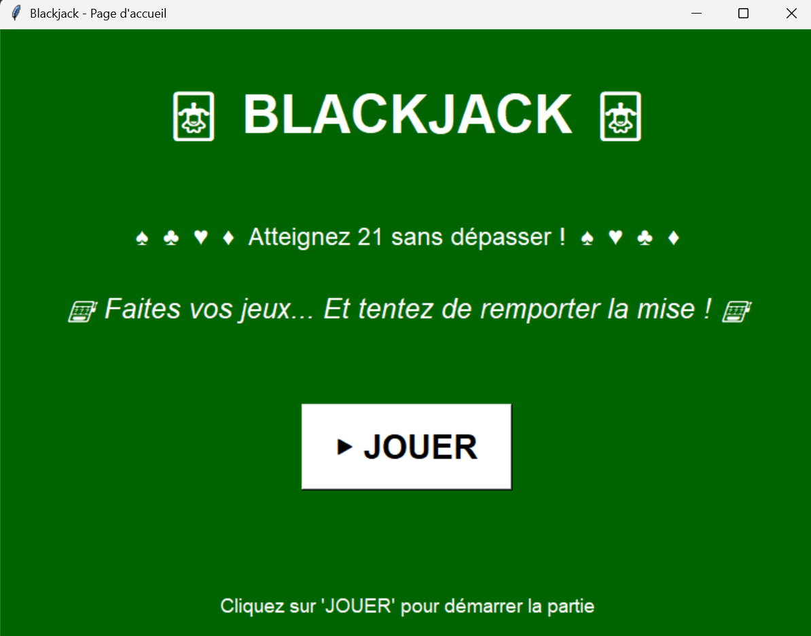

responsable GitHub: Charalampos Vekas
responsable de la qualité du code: Bala Diagne
Membres du groupe:
Ethan Chartrain , LDD MP , 22410387
Bala Diagne, LDD MP, 22406490
Charalampos Vekas, LDD MP, 22402484
Eve Guyard, LDD MP, 22403352

BLACKJACK: https://github.com/CharalamposV/Blackjack/new/main

Ce programme est un jeu de Blackjack qui s'adresse notamment aux personnes qui veulent découvrir le jeu de Blackjack sans pour autant prendre de risque financier .

Avant d'utiliser ce programme il est recommandé d'aller lire les regles du Blackjack nous pouvons vous rediriger vers ce site pour les régles:
https://www.casino-annecy.com/black-jack-1169#:~:text=Le%20but%20du%20black%20jack,1%2C5%20fois%20la%20mise

Pour pouvoir l'utiliser il faudra avoir les bibliothèques suivantes d'installées:
- Tk inter
- Pillow
- Random

Au lancemment il y'aura une page d'acceuil:

Ce menu accueille le joueur dans notre interface de jeu, et lui propose de débuter une partie ou non. 
Si le joueur accepte de jouer il sera redirigé vers le tapis de jeu:
[tapis de jeu](image-2.png)

Donc comme vous pouvez le voir sur le tapis de jeu le joueur aura ses cartes sur la ligne du bas et celles du croupier sur la ligne du haut.
Le joueur aura à sa disposition les boutons Hit, Stand, possibilité de mise, abandon, permettant respectivement de:

-Pour le Hit et le Stand ceux-ci permettent de faire exactemment ce que décrivent ces actions dans le vrai jeu de Blackjack.

-Le bouton mise lui ouvre un menu déroulant qui permet de mettre un des coefficients suivants sur sa mise: 2,5 ou 10.

-Le bouton abandon comme son nom l'indique fait directement perdre le joueur.

Si la partie se termine d'une quelconque manière alors la page suivante apparaîtra:
[page de fin de jeu](image-3.png)

Si le joueur souhaite relancer une partie il devra sélectionner le bouton rejouer, il sera alors redirigé vers un tapis comme si il vennait de lancer une partie
, si le joueur sélectionne le bouton quitter alors le programme se fermera.

